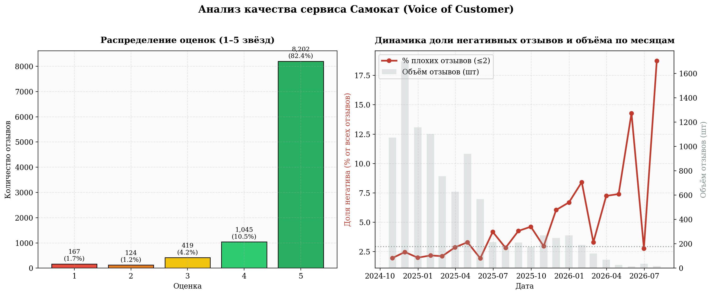
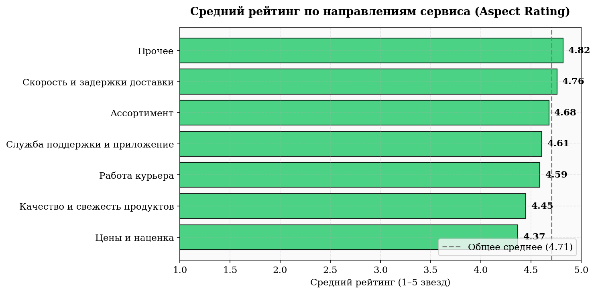
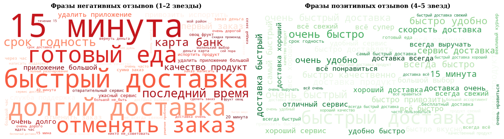
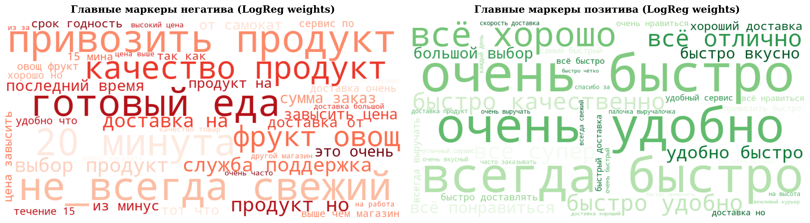

# Samokat Reviews Analysis

Анализ отзывов пользователей сервиса Самокат с использованием NLP и машинного обучения.# Анализ отзывов сервиса «Самокат»

Собрал и проанализировал ~10 000 отзывов о сервисе доставки продуктов «Самокат» с сайта Т-Банка — что клиентам нравится, на что жалуются, и как меняется отношение по времени.

---

## 📌 Что делает

* **Сбор данных** — забирает отзывы через API сайта (нашёл эндпоинт через DevTools, вместо того чтобы кликать по кнопке «Показать ещё» в браузере — так в разы быстрее: ~10 000 отзывов за 2 минуты вместо часа).
* **Очистка текста** — убирает мусорные символы, приводит «ё»/«ë» к одному виду, лемматизирует слова (через `pymorphy3`), отдельно обрабатывает частицу «не» (чтобы «не нравится» не разваливалось на два нейтральных слова).
* **Анализ** — считает, какие фразы чаще всего встречаются в плохих и хороших отзывах (`TF-IDF` + `LogisticRegression`), группирует отзывы по темам (доставка, цены, качество продуктов, курьеры, приложение), строит графики: распределение оценок, динамика доли негативных отзывов по месяцам, средний рейтинг по темам.
* **(Опционально) LLM** — прогоняет выборку отзывов через Gemini API, чтобы получить текстовое резюме в духе «что чинить в первую очередь». Тут стоит быть осторожным: модель иногда добавляет цифры и детали, которых не было в исходных данных — использовать как черновик для формулировок, а не как источник фактов.

---

## 🛠 Стек

* **Data & Parsing:** `Python`, `pandas`, `requests`, `openpyxl`
* **NLP & ML:** `pymorphy3`, `scikit-learn` (TF-IDF, LogisticRegression)
* **Visualization:** `matplotlib`, `seaborn`, `wordcloud`
* **LLM Integration:** `Google Gemini API`, `python-dotenv`

---

## 📊 Визуализация результатов

### 1. Распределение оценок и динамика негатива


### 2. Рейтинг по темам и аспектам


### 3. Облака слов (Исходный текст vs Очищенный)
| Сырые данные | После NLP-очистки |
| :---: | :---: |
|  |  |


### 4. Ответ LLM gemini-3.6-flash - 
На основе анализа репрезентативной выборки клиентских отзывов подготовлен отчёт о ключевых факторах удержания и оттока пользователей. Сервис сохраняет сильное ценностное предложение за счёт скорости и СТМ, однако сталкивается с высоким риском оттока из-за падения качества продуктов (Категория Fresh), сбоев в логистических SLA и бюрократизированного клиентского сервиса.

---

### 1. Главные драйверы удовлетворённости (Почему клиенты остаются)

1. **Скорость и удобство доставки (Core Value Proposition):**
   * Когда сервис работает штатно, доставка за 10–15 минут остаётся главным киллер-фичей, ради которой клиенты готовы прощать наценку.
   * *Цитата:* «Самое лучшее за 15 минут до двери, если очень хочется вкусного сразу и быстро».
2. **Успешный СТМ и эксклюзивный ассортимент:**
   * Продукция под собственным брендом (десерты, выпечка, молочная продукция, мороженое) получает стабильно высокие оценки за состав и вкус.
   * *Цитата:* «Продукты Самокат всегда с хорошим составом! Настолько, что такие еще придется поискать среди аналогов».
3. **Бесплатная доставка и опция «Оставить у двери»:**
   * Отсутствие явных сервисных сборов (в отличие от конкурентов) и бесконтактная доставка формируют высокий уровень комфорта.
4. **Интеграция с программами лояльности (СберСпасибо, промокоды):**
   * Возможность списывать бонусы и использовать выгодные скидки на первый/повторный заказ стимулирует конверсию в покупку.

---

---


##  Структура проекта

```text
.
├── data/
│   ├── raw/
│   │   └── reviews_raw.xlsx        # Сырые данные с парсера (~10k отзывов)
│   └── processed/
│       └── reviews_final.xlsx      # Очищенный и лемматизированный датасет
├── .env                            # Переменные окружения (GOOGLE_API_KEY)
├── .gitignore                      # Исключения Git
├── analysis.ipynb                  # Весь код анализа и моделирования
├── aspect_ratings.png              # График среднего рейтинга по темам
├── eda_report.png                  # Распределение оценок и динамика негатива
├── README.md                       # Документация проекта
├── requirements.txt                # Зависимости Python
├── wordclouds.png                  # Облака слов (сырой текст)
└── wordclouds_clean.png            # Облака слов (после лемматизации)
```
## Как запустить

```bash
git clone https://github.com/maximusquant/samokat-reviews-analysis.git
cd samokat-reviews-analysis
py -m pip install -r requirements.txt
py -m jupyter notebook analysis.ipynb


